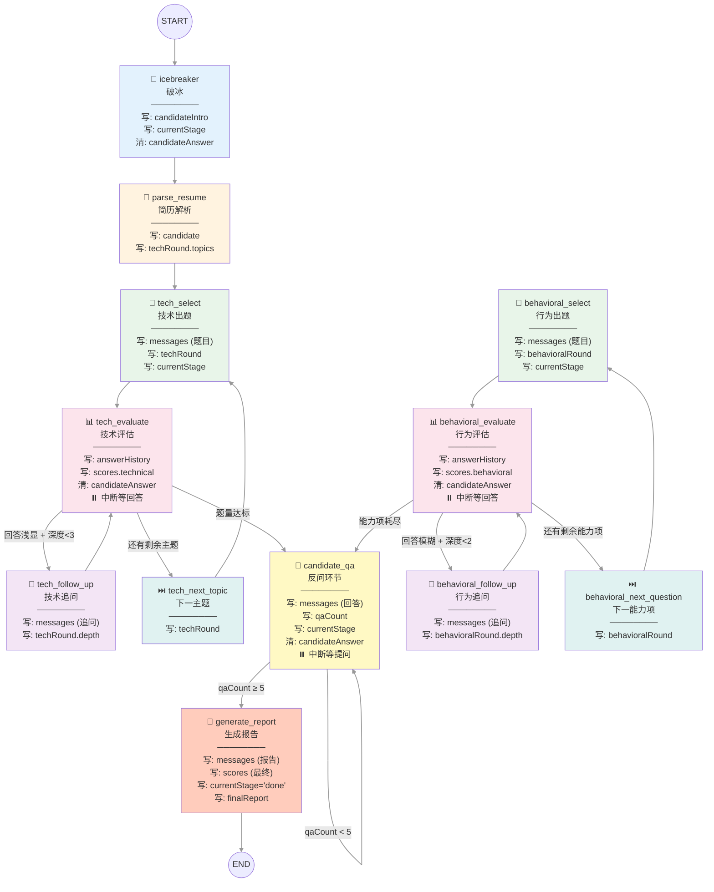
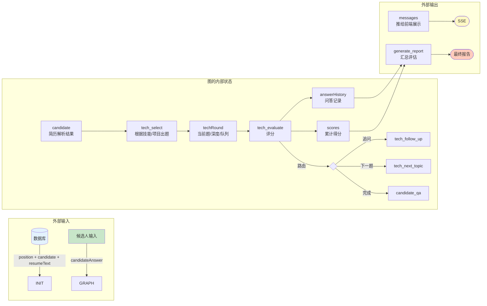

# 面试图状态可视化

## 1. 图结构总览



## 2. 字段 × 节点矩阵

```
图例:  ✍ 写入(替换)  ➕ 追加  🔀 合并  📖 只读  🧹 清空  ⏸️ 中断点  · 不涉及
╔══════════════════════╦══════╦══════╦══════╦══════╦══════╦══════╦══════╦══════╦══════╦══════╦══════╦══════╗
║                      ║ 🧊   ║ 📄   ║ 🎯   ║ 📊   ║ 🔁   ║ ⏭️   ║ 🎯   ║ 📊   ║ 🔁   ║ ⏭️   ║ 💬   ║ 📝   ║
║       字段            ║icebrk║parse ║tech  ║tech  ║tech  ║tech  ║behav ║behav ║behav ║behav ║cand. ║gen.  ║
║                      ║      ║resume║select║eval  ║follow║next  ║select║eval  ║follow║next  ║qa    ║report║
╠══════════════════════╬══════╬══════╬══════╬══════╬══════╬══════╬══════╬══════╬══════╬══════╬══════╬══════╣
║ candidate            ║  ·   ║  ✍   ║  📖  ║  ·   ║  ·   ║  ·   ║  ·   ║  ·   ║  ·   ║  ·   ║  ·   ║  📖  ║
║ position             ║  ·   ║  📖  ║  📖  ║  ·   ║  ·   ║  ·   ║  📖  ║  ·   ║  ·   ║  ·   ║  📖  ║  📖  ║
║ currentStage         ║  ✍   ║  ·   ║  ✍   ║  ✍   ║  ✍   ║  ·   ║  ✍   ║  ✍   ║  ·   ║  ·   ║  ✍   ║  ✍   ║
║ candidateAnswer      ║  📖🧹║  ·   ║  ·   ║  📖🧹║  ·   ║  ·   ║  ·   ║  📖🧹║  ·   ║  ·   ║  📖🧹║  ·   ║
║ candidateIntro       ║  ✍   ║  ·   ║  📖  ║  ·   ║  ·   ║  ·   ║  📖  ║  ·   ║  ·   ║  ·   ║  ·   ║  ·   ║
║ resumeText           ║  ·   ║  📖  ║  ·   ║  ·   ║  ·   ║  ·   ║  ·   ║  ·   ║  ·   ║  ·   ║  ·   ║  ·   ║
║ interviewType        ║  ·   ║  ·   ║  ·   ║  ·   ║  ·   ║  ·   ║  ·   ║  ·   ║  ·   ║  ·   ║  ·   ║  ·   ║
║ qaCount              ║  ·   ║  ·   ║  ·   ║  ·   ║  ·   ║  ·   ║  ·   ║  ·   ║  ·   ║  ·   ║  📖✍ ║  ·   ║
║ messages ➕           ║  ·   ║  ·   ║  ➕   ║  ·   ║  ➕   ║  ·   ║  ➕   ║  ·   ║  ➕   ║  ·   ║  ➕   ║  ➕   ║
║ answerHistory ➕      ║  ·   ║  ·   ║  ·   ║  ➕   ║  ·   ║  ·   ║  ·   ║  ➕   ║  ·   ║  ·   ║  ·   ║  📖  ║
║ scores 🔀            ║  ·   ║  ·   ║  ·   ║  🔀   ║  ·   ║  ·   ║  ·   ║  🔀   ║  ·   ║  ·   ║  ·   ║  🔀   ║
║ techRound            ║  ·   ║  ✍   ║  ✍   ║  📖  ║  ✍   ║  ✍   ║  ·   ║  ·   ║  ·   ║  ·   ║  ·   ║  ·   ║
║ behavioralRound      ║  ·   ║  ·   ║  ·   ║  ·   ║  ·   ║  ·   ║  ✍   ║  📖  ║  ✍   ║  ✍   ║  ·   ║  ·   ║
╠══════════════════════╩══════╩══════╩══════╩══════╩══════╩══════╩══════╩══════╩══════╩══════╩══════╩══════╣
║ ⏸️ = interrupt() 中断点                                                                                  ║
║ 🧊=icebreaker 📄=parse_resume 🎯=select 📊=evaluate 🔁=follow_up ⏭️=next 💬=candidate_qa 📝=report     ║
╚══════════════════════════════════════════════════════════════════════════════════════════════════════════╝
```

## 3. 数据流向图



## 4. 节点读写热力图

```
读取频率 (📖 越多 = 越依赖全局状态)
─────────────────────────────────────────────
icebreaker:               ║█ ║  1个(candidateAnswer)
parse_resume:             ║██ ║  2个(position, resumeText)
tech_select:              ║███║  3个(candidate, position, candidateIntro)
tech_evaluate:            ║██ ║  2个(techRound, candidateAnswer)
tech_follow_up:           ║██ ║  2个(techRound, answerHistory)
tech_next_topic:          ║█ ║  1个(techRound)
behavioral_select:        ║██ ║  2个(position, candidateIntro)
behavioral_evaluate:      ║██ ║  2个(behavioralRound, candidateAnswer)
behavioral_follow_up:     ║█ ║  1个(answerHistory)
behavioral_next_question: ║█ ║  1个(behavioralRound)
candidate_qa:             ║███║  3个(candidateAnswer, qaCount, position)
generate_report:          ║███║  3个(candidate, position, answerHistory)

写入频率 (✍ 越多 = 副作用越大)
─────────────────────────────────────────────
icebreaker:               ║██ ║  2个(currentStage, candidateIntro)
parse_resume:             ║██ ║  2个(candidate, techRound)
tech_select:              ║██ ║  2个(messages, techRound)
tech_evaluate:            ║██ ║  2个(answerHistory, scores)
tech_follow_up:           ║██ ║  2个(messages, techRound)
tech_next_topic:          ║█ ║  1个(techRound)
behavioral_select:        ║██ ║  2个(messages, behavioralRound)
behavioral_evaluate:      ║██ ║  2个(answerHistory, scores)
behavioral_follow_up:     ║██ ║  2个(messages, behavioralRound)
behavioral_next_question: ║█ ║  1个(behavioralRound)
candidate_qa:             ║███║  3个(messages, qaCount, currentStage)
generate_report:          ║████║ 4个(messages, currentStage, scores, finalReport)
```

## 5. 三种 Reducer 行为

```
┌──────────────────────────────────────────────────────────────┐
│                      替换 (默认 reducer)                      │
│  currentStage  candidate  position  techRound  behavioralRound│
│  qaCount  candidateAnswer  resumeText  candidateIntro        │
│  interviewType                                               │
│                                                              │
│  新值直接覆盖旧值，不保留历史                                   │
│  例: currentStage = 'icebreaker' → 'technical' → 'qa'        │
├──────────────────────────────────────────────────────────────┤
│                      追加 (+) reducer                        │
│  messages  answerHistory                                     │
│                                                              │
│  reducer: (prev, next) => [...prev, ...next]                 │
│  新条目追加到数组末尾，不删除已有内容                            │
│  例: messages = [msg1, msg2] + [msg3] = [msg1, msg2, msg3]  │
├──────────────────────────────────────────────────────────────┤
│                      合并 ({}) reducer                       │
│  scores                                                      │
│                                                              │
│  reducer: (prev, next) => ({ ...prev, ...next })            │
│  新 key 覆盖旧 key，未提供的 key 保留原值                       │
│  例: {tech:0, behav:0} + {tech:7} = {tech:7, behav:0}       │
└──────────────────────────────────────────────────────────────┘
```

## 6. 三个中断点

```
ICE ⟳ ──────── ─ ─ ─ ─ ─ ─ ─ ─ ─ ─ ─ ─ ─ ─ ─ ─ ─ ─
  icebreaker → 等待用户自我介绍 → POST /message → 继续
 ───────────────────────────────────────────────── ─ ─

TECH ⟳ ──────── ─ ─ ─ ─ ─ ─ ─ ─ ─ ─ ─ ─ ─ ─ ─ ─ ─ ─
  tech_evaluate → 等待候选人回答 → POST /message → 继续
 ───────────────────────────────────────────────── ─ ─

BEHAV ⟳ ──────── ─ ─ ─ ─ ─ ─ ─ ─ ─ ─ ─ ─ ─ ─ ─ ─ ─ ─
  behavioral_evaluate → 等待候选人回答 → POST /message → 继续
 ───────────────────────────────────────────────── ─ ─

QA ⟳ ──────── ─ ─ ─ ─ ─ ─ ─ ─ ─ ─ ─ ─ ─ ─ ─ ─ ─ ─
  candidate_qa → 等待候选人提问 → POST /message → 继续
 ───────────────────────────────────────────────── ─ ─
```
