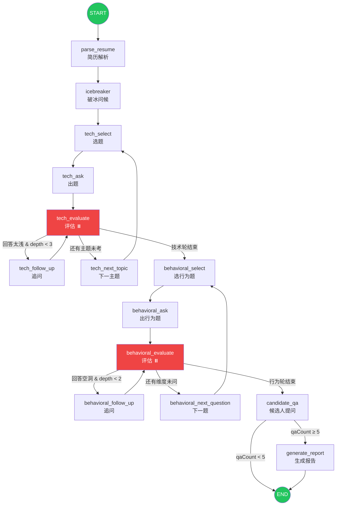

# Interview Graph



## Routing Logic

### tech_evaluate → 三选一

```typescript
routeInTechnical(state):
  // 没有评估记录 → 回到 tech_ask（理论上不走）
  if (!lastRecord || lastRecord.stage !== 'technical') → tech_ask

  // 回答太浅 & 追问不超过 3 层 → 追问
  if (evaluation.isSurfaceLevel && depth < 3) → tech_follow_up

  // 还有主题没考完 → 换下一题
  if (questionsAsked.length < topics.length + 2) → tech_next_topic

  // 技术轮结束
  → behavioral_select
```

### behavioral_evaluate → 三选一

```typescript
routeInBehavioral(state):
  // 没有评估记录 → 回到 behavioral_ask
  if (!lastRecord || lastRecord.stage !== 'behavioral') → behavioral_ask

  // 回答空洞 & 追问不超过 2 层 → 追问
  if (evaluation.isVague && depth < 2) → behavioral_follow_up

  // 还有能力维度没问 → 换下一题
  if (questionsAsked.length < competencies.length) → behavioral_next_question

  // 行为轮结束
  → candidate_qa
```

### candidate_qa → 二选一

```typescript
routeAfterCandidateQA(state):
  qaCount >= 5 → generate_report
  否则 → END（允许候选人继续问）
```

## Marked with ⏸️ = interrupt point

Graph pauses at `interrupt()` calls in `tech_evaluate` and `behavioral_evaluate` when `candidateAnswer` is empty.
User answer resumes via `updateState` + `stream(null)`.
